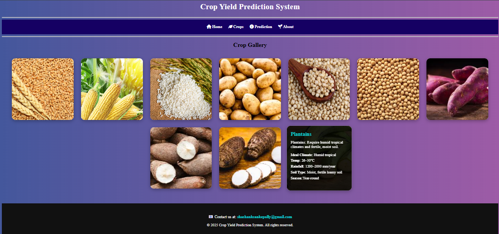

# Crop Yield Prediction System using Machine Learning 

 🌿 Welcome to the Crop Yield Prediction Assistant!
Your smart companion for modern farming. Enter your soil and environmental details, and our system will
            provide fast, accurate predictions to help you grow the right crops for your land. Let's take the guesswork
            out
            of agriculture and make every harvest more profitable and sustainable.
<details style="max-width: 800px; margin: 20px auto; color: white;">
        <summary style="font-size: 18px; cursor: pointer;">💡 How does the prediction model work?</summary>
        <p style="margin-top: 10px;">It uses a machine learning algorithm trained on historical data including rainfall,
            temperature, pesticides, etc., to forecast likely yield output.</p>
    </details>
 <details style="max-width: 800px; margin: 10px auto; color: white;">
        <summary style="font-size: 18px; cursor: pointer;">🌾 Which crops are supported?</summary>
        <p style="margin-top: 10px;">Currently, the system supports 10 major crops like wheat, rice, maize, pulses, and
            more.</p>
    </details>


## Table of Contents

- [About](#about)
- [Limitations & Future Work](#limitations--future-work)
- [Features](#features)
- [Requirements](#requirements)
- [Setup and Installation](#setup-and-installation)
- [Screenshots](#screenshots)
- [License](#license)

---

## About

The **Crop Yield Prediction System** is a machine learning-powered application that predicts the expected yield of crops based on user inputs such as temperature, rainfall, pH, and soil nutrients. It aims to support farmers in making informed decisions about crop planning and resource utilization, ultimately improving productivity and sustainability in agriculture.

---

## Limitations & Future Work

### Limitations
- Prediction accuracy is dependent on dataset quality and model performance.
- May not perform well in regions with extreme weather anomalies not present in training data.
- Currently supports limited crop types and input parameters.

### Future Enhancements
- Add real-time weather and satellite data integration.
- Expand crop and soil type coverage.
- Implement recommendation system for best crops per region and season.
- Add multilingual support for farmers in different regions.

---

## Features

- Predict crop yield using trained ML models
- User-friendly web interface with dynamic inputs
- Support for various crops and soil conditions


---

## Requirements

### Python Dependencies:
- Python 3.7+
- Flask
- scikit-learn
- pandas
- numpy
- matplotlib (optional)
- Jupyter (for training notebook)

## Setup and Installation

```shell
git clone https://github.com/shashank9391/crop-yield-prediction-system.git
cd crop-yield-prediction-system
```
Run the following command to start the application:
```shell
python app.py
```
## Screenshots

**Home Page of crop yield prediction system.**


**Crop gallery.**


**Prediction page.**


**About us.**

## License

This project is licensed under the [Apache License 2.0](LICENSE) - see the [LICENSE](LICENSE) file for details.
